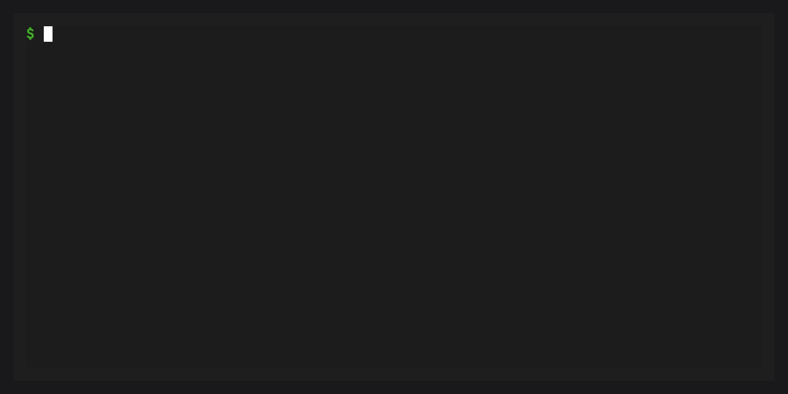

# conda-self

Manage your conda `base` environment safely.

conda-self provides commands to install, update, and remove
[conda plugins](inv:conda:std:doc#dev-guide/plugins/index)
in a protected base environment. It integrates with
[conda doctor](inv:conda:std:doc#commands/doctor) to set up base
protection -- cloning your current base to a `default` environment,
removing packages not retained by base protection, and marking it as frozen so
regular conda commands refuse to modify it unless `--override-frozen` is
passed.

## Quick example



```bash
# Protect your base environment
$ conda doctor base-protection --fix

# Install a plugin safely
$ conda self install conda-index

# Update all installed packages
$ conda self update --all

# Remove a plugin
$ conda self remove conda-index

# Reset base if things go wrong
$ conda self reset
```

## What it does

`conda self` keeps your base environment minimal and stable:

1. **Base protection** -- `conda doctor base-protection --fix` clones base to
   `default`, removes packages not retained by base protection, and marks it as
   frozen
2. **Plugin management** -- `conda self install`, `update`, and `remove`
   use `--override-frozen` to manage plugins through subprocess calls that
   respect all of conda's safety checks
3. **Reset** -- `conda self reset` restores base from an installer or
   base-protection snapshot, or removes packages not retained by `current`

## Navigation

:::::::{grid} 1 1 2 2
:gutter: 3

::::::{grid-item-card} {octicon}`rocket;1em` Getting started
:link: quickstart
:link-type: doc

Protect your base environment and manage plugins in under a minute.
::::::

::::::{grid-item-card} {octicon}`mortar-board;1em` Tutorials
:link: tutorials/index
:link-type: doc

Step-by-step guides for protecting base, managing plugins, and more.
::::::

::::::{grid-item-card} {octicon}`star;1em` Features
:link: features
:link-type: doc

Base protection, plugin validation, snapshots, and health checks.
::::::

::::::{grid-item-card} {octicon}`gear;1em` Configuration
:link: configuration
:link-type: doc

Settings, snapshot files, and environment variables.
::::::

::::::{grid-item-card} {octicon}`terminal;1em` CLI reference
:link: reference/cli
:link-type: doc

Every `conda self` subcommand and `conda doctor` integration.
::::::

::::::{grid-item-card} {octicon}`light-bulb;1em` Motivation
:link: motivation
:link-type: doc

Why conda-self exists and how it keeps base safe.
::::::

:::::::

```{toctree}
:hidden:
:caption: Tutorials

quickstart
tutorials/index
```

```{toctree}
:hidden:
:caption: How-to guides

guides/resetting-base
guides/custom-channels
```

```{toctree}
:hidden:
:caption: Reference

reference/cli
configuration
```

```{toctree}
:hidden:
:caption: Explanation

features
motivation
```

```{toctree}
:hidden:
:caption: Project

changelog
```
