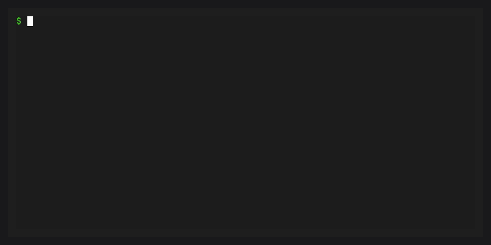

# Quick start

This guide walks you through protecting your base environment and
managing plugins with conda-self.

## Prerequisites

- conda 26.1.1 or later
- conda-self installed in base (`conda install -n base conda-self`)

## Protect your base environment


Using [conda doctor](inv:conda:std:doc#commands/doctor), check whether base is
currently protected:

```bash
conda doctor -n base base-protection
```

If it is not, enable protection:

```bash
conda doctor -n base base-protection --fix
```

This does four things:

1. Tries to save a snapshot of base in conda's explicit format
2. Clones your current base environment to a new `default` environment
3. Removes conda packages other than conda, conda-self, configured permanent
   packages, their dependencies, and installed conda packages named in an
   available installer snapshot
4. Marks base as frozen so regular conda commands refuse to modify it unless
   `--override-frozen` is passed

:::{tip}
You only need to run this once. After protection, use `conda self`
commands to manage plugins in base.
:::

## Install a plugin



```bash
conda self install conda-index
```

conda-self installs the package via a subprocess and checks whether it registers
as a [conda plugin](inv:conda:std:doc#dev-guide/plugins/index). If validation
fails, conda-self uninstalls the requested package. Packages installed as its
dependencies may remain.

## Update all installed packages

```bash
conda self update --all
```

This updates every installed package in the base environment.

## Remove a plugin


```bash
conda self remove conda-index
```

Conda-self protects conda, conda-self, configured permanent packages, and their
dependencies from direct removal requests unless `--force` is passed. Conda's
own transaction checks still apply.

## Reset base


If something goes wrong, automatically select a reset mode:

```bash
conda self reset
```

## Next steps

- {doc}`tutorials/protecting-base` -- A deeper walkthrough of base
  protection and what happens under the hood
- {doc}`tutorials/managing-plugins` -- Install, update, and remove
  plugins with confidence
- {doc}`features` -- How base protection, snapshots, and plugin
  validation work
- {doc}`reference/cli` -- Every command and flag
